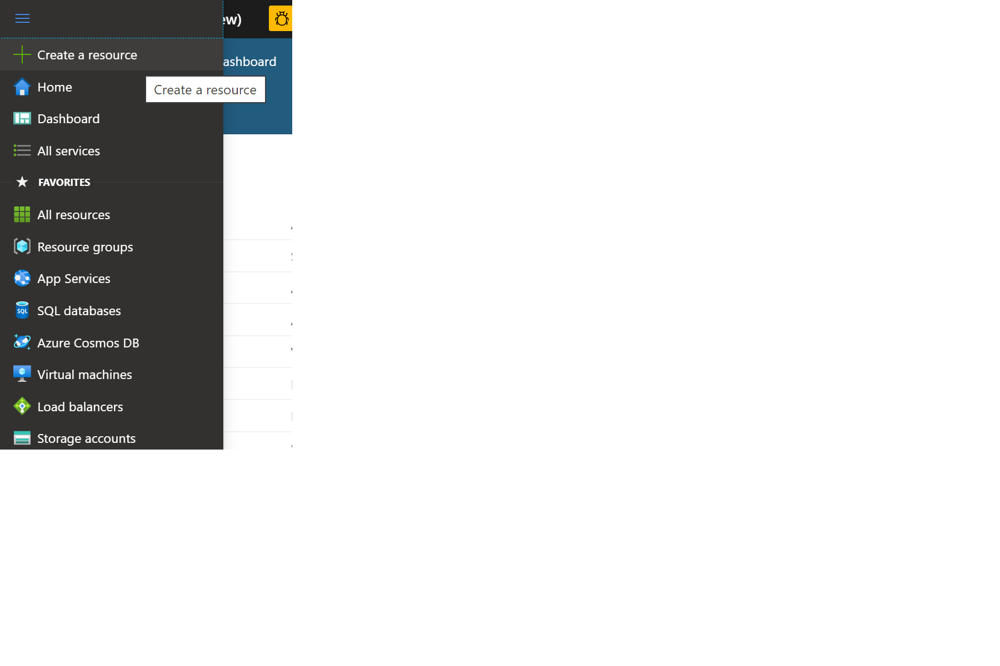
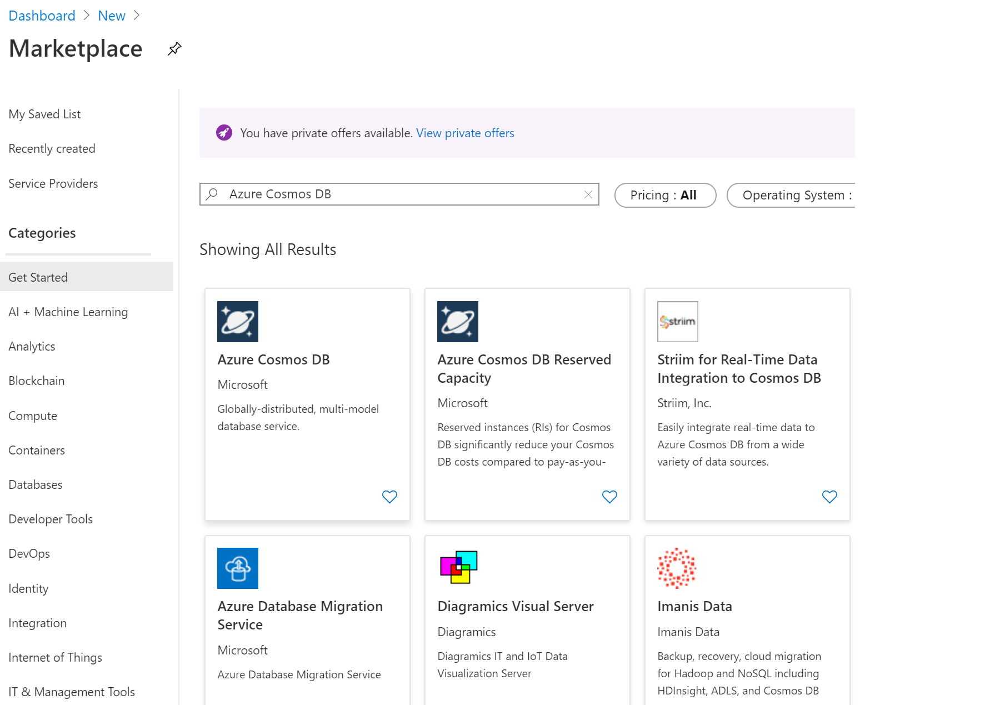
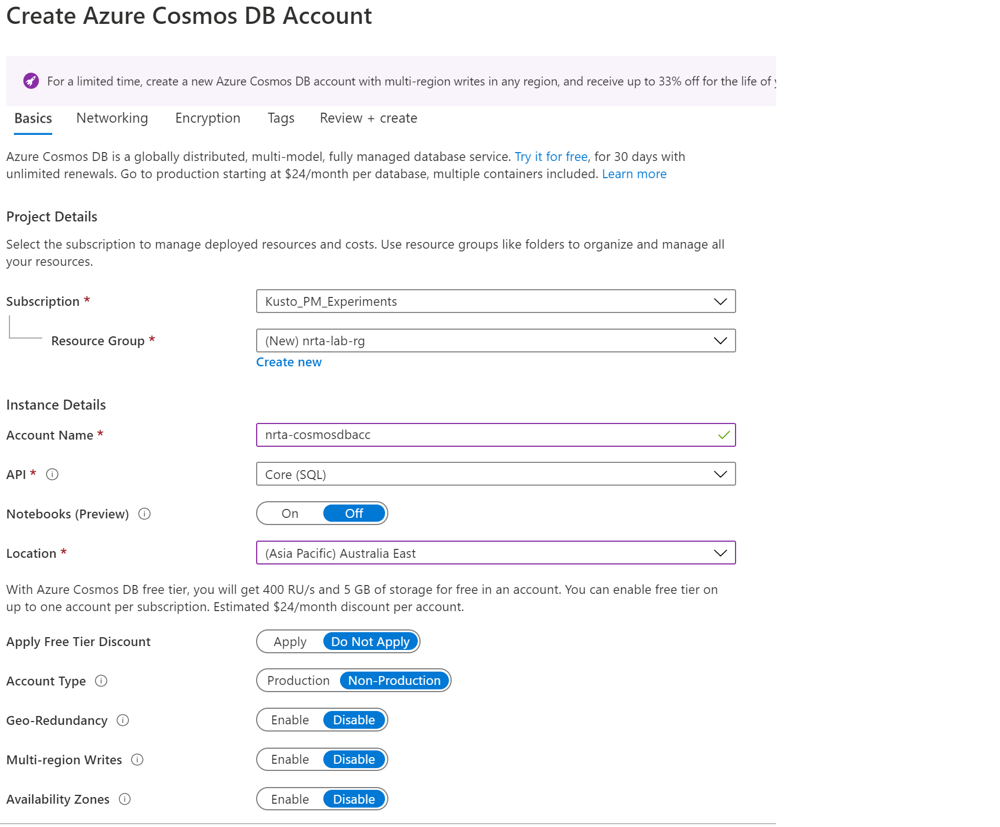
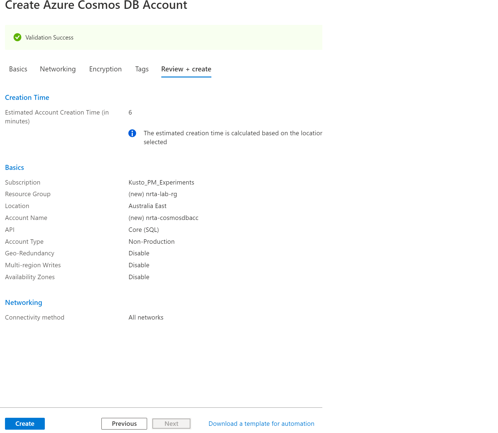
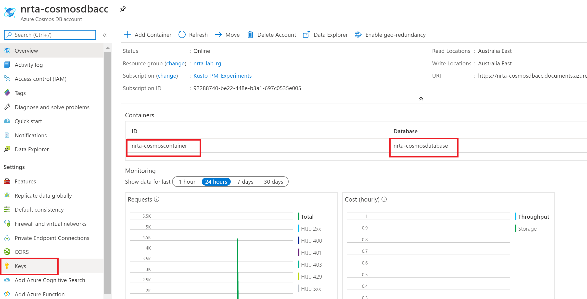
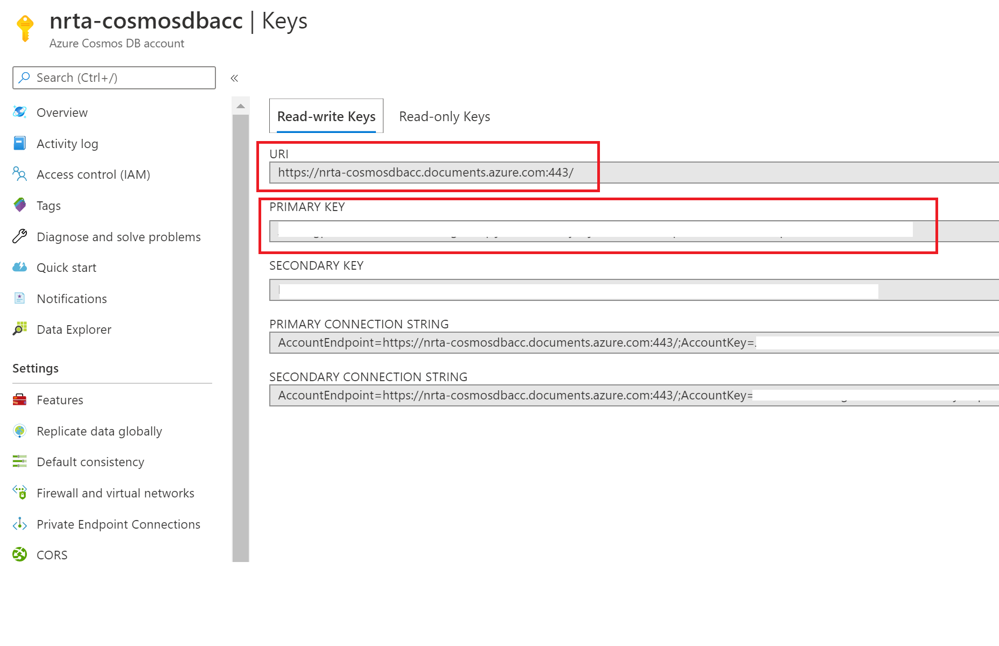

## Create Cosmos DB account, database and container
In this module, we will create Cosmos DB which is used as an operational store in this lab. 
Note down the keys, connection strings to be used in the next modules. Follow below mentioned steps in sequence -  

1. On the Azure portal, navigate to 'Create a resource'.

2. Search for 'Azure Cosmos DB' on Azure marketplace and click 'Create'.

3. Enter details as shown below to create Cosmos DB account. 

### NOTE - 
New resource group **'nrta-lab-rg'** created in this step will be used while creating other resources. I will be using 'nrta' prefix throughout the lab which is just a short form for 'near real time analysis' created by me for this lab:).  Navigating to resource creation screen and search for different resources for creation is going to be same for all resources, just different resource names so I wont be repeating these screenshots in next modules. 

4. Click 'Next' with all default settings for 'Networking', 'Encryption' and 'Tags' tabs.

5. Click 'Create' on this last screen which shows all selected configuration details.

6. Note the Cosmos DB name, container name and click on Keys to get the URI and authentication key

7. Copy all 4 values highlighted in red in screenshots of Step 6 and 7 on a notepad to be used in next steps, values are of Cosmos DB name, container name, URI and key.

