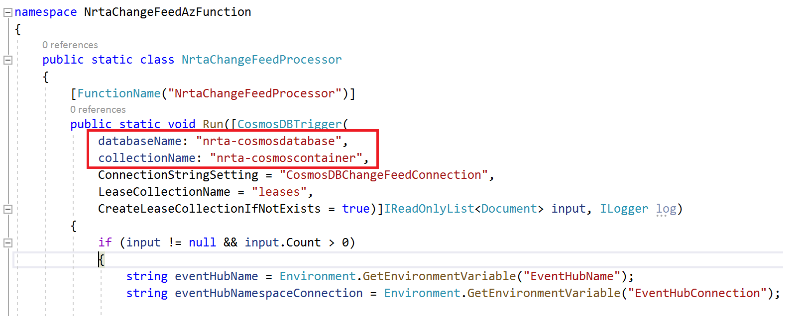
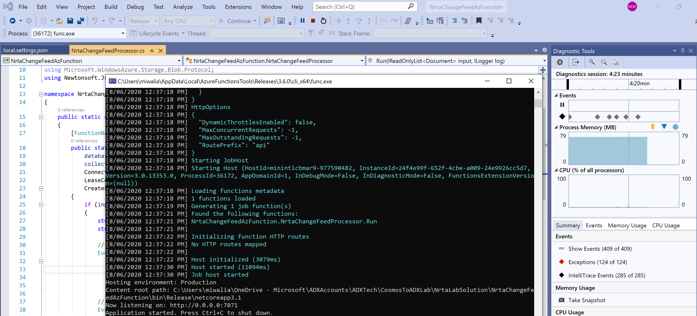

## Create and run Azure function to be triggered by Cosmos DB Change feed
In this module, we will create an Azure function that gets triggered when data is added or changed in Cosmos DB. Azure function has a natively supported Cosmos DB trigger which will be leveraged in this case.<br/>

1. You can create an Azure function using Visual Studio(VS) 'Azure functions' project or using azure portal as explained in this [link](https://docs.microsoft.com/en-us/azure/azure-functions/functions-create-cosmos-db-triggered-function#:~:text=Create%20Azure%20Cosmos%20DB%20trigger,-In%20your%20function&text=On%20the%20New%20Function%20page,Azure%20Cosmos%20DB%20trigger%20template.&text=The%20name%20of%20the%20function.&text=Select%20New%2C%20the%20Database%20Account,setting%20for%20your%20account%20connection.)
To make it easy and cost effective for lab purpose, I have used VS way so you can run it on your local system. You can download azure function code from [here]().
2. Open 'NrtaChangeFeedAzFunction.sln' solution file using VS.
3. Open 'local.settings.json' file and fill in the values you had noted on notepad in previous modules. If you kept all the services and resources names same as described in previous lab modules then you just need to change the account keys in angular brackets in settings file shown below -
```
"Values": {
    //Azure BLOB storage account details 
    "AzureWebJobsStorage": "DefaultEndpointsProtocol=https;AccountName=nrtastorageforazfunc;AccountKey=<Your storage account key>;BlobEndpoint=https://nrtastorageforazfunc.blob.core.windows.net/;TableEndpoint=https://nrtastorageforazfunc.table.core.windows.net/;QueueEndpoint=https://nrtastorageforazfunc.queue.core.windows.net/;FileEndpoint=https://nrtastorageforazfunc.file.core.windows.net/",

    // 'Primary connection string' from Azure Cosmos DB account
    "CosmosDBChangeFeedConnection": "AccountEndpoint=https://nrta-cosmosdbacc.documents.azure.com:443/;AccountKey=<Your Cosmos DB account key>;",

    // 'Connection string-prmiary key' from Azure Event Hub namespace
    "EventHubConnection": "Endpoint=sb://nrtalab.servicebus.windows.net/;SharedAccessKeyName=RootManageSharedAccessKey;SharedAccessKey=<Your event hub namespace shared access key>",

    // Azure Event hub name
    "EventHubName": "nrta-lab-eventhub",
    
    "FUNCTIONS_WORKER_RUNTIME": "dotnet"
  }
  ```  
 
  4. Open 'NrtaChangeFeedProcessor.cs' file, change the Cosmos DB and container name in the parameters of the **Run** method. 
  This change is needed only if you didnt follow the same names as in previous modules of labs.
   
  5. Build the project and run it, you will see following screen with a message 'Job host started' if it runs successfully -
   
