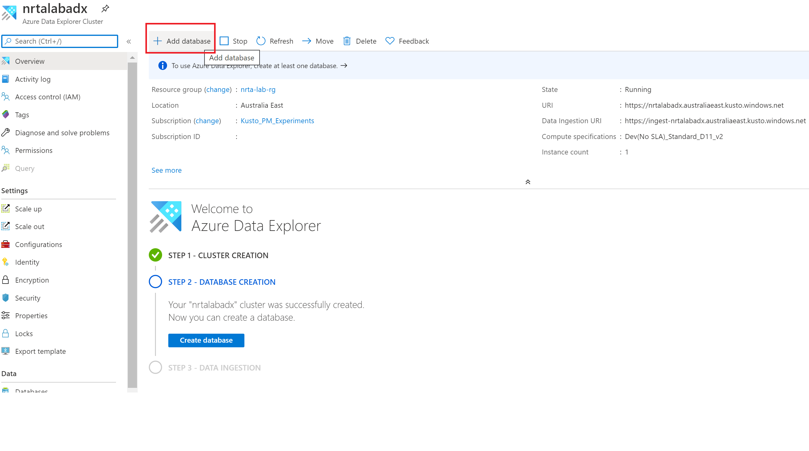
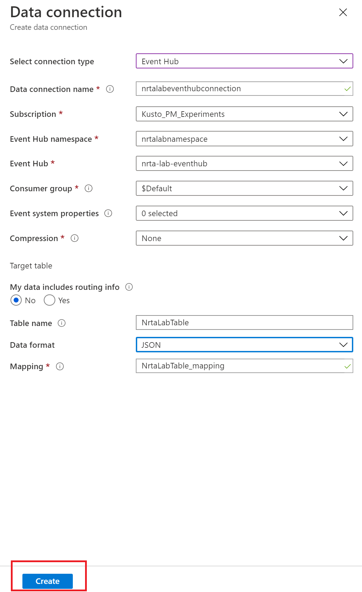

## Create Azure Data Explorer
In this module, we will create Azure Data Explorer(ADX) cluster.<br>
ADX is a fully-managed big data analytics and data exploration service on azure. It supports both batch and streaming scenarios to ingest structured, semi-structured and unstructured(free text) data.

1. On azure portal home page, select 'Create a resource' option from left menu.
2. Search for 'Azure Data Explorer', select an option as shown below and click 'Create'

3. Enter details as shown below

4. Select Next, I am keeping default setting. You can scale up or scale out cluster in case you plan to test it with large volumes of data. Or you can select an optimized autoscale option too which will automatically scale up/down or in/out your cluster.

5. Enable streaming ingestion option as we will be ingesting small amounts of data which wont be enough for batch ingestion. 

6. Select Next with default values for 'Security', 'Network' and 'Tags' tabs then click 'Create' on the last screen for creation flow as shown below

7. Now add Database in your ADX cluster

8. Fill in the details as shown below


9. Create table in ADX
```
.create table NrtaLabTable (ShoppingCartID: int, Action: string, Item: string, Price:real, UniqueID:guid, Timestamp: datetime)
```
10. Create corresponding table mapping for the table columns mapping to the fields in JSON document
```
.create table NrtaLabTable ingestion json mapping 'NrtaLabTable_mapping' '[{"column":"ShoppingCartID","path":"$.ShoppingCartID","datatype":"int"},{"column":"Action","path":"$.Action","datatype":"string"},{"column":"Item","path":"$.Item","datatype":"string"},{"column":"Price","path":"$.Price","datatype":"real"},{"column":"UniqueID","path":"$.id","datatype":"guid"},{"column":"Timestamp","path":"$._ts","datatype":"datetime"}]'
```
### NOTE -
You can also use [one-click ingestion](https://docs.microsoft.com/en-us/azure/data-explorer/ingest-data-one-click) feature to ingest one of the sample document which will automatically create above mentioned table and table mapping for you. Also, you can copy commands from one-click ingestion as shown below -

<br/>
**Click on 'Edit Schema'**

<br/>

11. Now create ADX data connection to the ingestion service which is event hub in this case

<br/>

12. Select Event Hub

<br/>

13. Fill in the details as shown below and thats all about ADX cluster creation and connection building with event hub.

