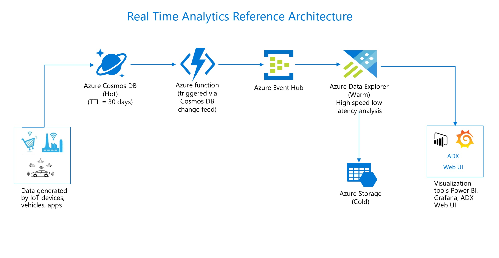

# Build near real time analytical solution with Cosmos DB and Azure Data Explorer(ADX)

## In this hands on lab you will learn about how easy it is to connect Cosmos DB to Azure Data Explorer for building a near real time big data analytical solution. Few other azure services have been leveraged to build an end to end solution so you don't need to worry about demistifying parts of it.

## **NOTE**
There are multiple ways to build analytical solutions using different azure services, this is one of those different ways and by no means, this is THE only way. Similar outcomes can be achieved using other azure services which are not covered in this lab.

## Overview
The focus of this lab is to demonstrate how to use Cosmos DB as a transactional store and ADX as an analytical store, think of it like a polyglot persistence concept where it is best to use multiple technologies to store data based on the way data is being used by applications and components in the overall ecosystem. Its hard for one service to kill all the scenarios so let us utilize the strengths of both these services(Cosmos & ADX) to build a powerful real time analytical solution e.g. Cosmos DB is meant for building highly responsive distributed applications with its ability for point reads and look ups whereas ADX is extremely powerful for large scans, aggregations on the fly, time series analysis and machine learning scenarios. So lets combine these two technologies to build following reference architecture -


High level flow of the steps in this lab -
1. **Data Generation component** - This will simulate random data for this lab. Its a simple .Net program to generate sample data simulating ecommerce website's shopping cart information. Here is an example of one record of sample data -
```
{      
 	"ShoppingCartID": 2956,
 	"Action": "Purchased",
 	"Item": "Unisex Puffy Jacket",
 	"Price": 81.99
 }
 ```
 2. **Cosmos DB** - Cosmos DB will be used as a transactional store which will store generated data in a collection.
 3. **Change Feed** - The change feed will listen for changes to the Cosmos DB collection e.g. on an ecommerce website, whenever user views an item, adds an item to their cart, purchases an item etc will add a new document in Cosmos DB collection. For simplicity sake, lab is covering addition of new documents scenario only so every time a new document is added into the collection , the change feed will trigger an Azure Function.
Change Feed can be processed in push or pull model. Key difference in both models is who stores state for the last processed changes, its server in push model and client in case of pull model. I will be covering push model with natively supported Azure Functions Cosmos DB triggers in this lab, its the recommended approach due to following -
- Polling the change feed for future changes.
- Storing state for the last processed change. 
- Load balancing across multiple clients consuming changes. 
- Retrying failed changes that weren't correctly processed after an unhandled exception in code or a transient network issue.
4. **Azure Function** - The Azure Function will process the new data and send it to an Azure Event Hub.
5. **Event Hub** - The Azure Event Hub will store these events and send them to Azure Data Explorer.
6. **Azure Data Explorer(ADX)** - ADX will be used as an analytical store which will provide the ability to analyze data at a blazingly fast pace. Why ADX -
- You can ingest fast flowing high volumes of data with low latency in streaming or batch mode. Its an append only database so primarily meant for time series analysis, logs(could be from apps, CDN logs, user activity or any kind of logs generated by the enterprise systems).
- You can transform data. 
- You can do interactive analytics for exploration purposes in one of the most performant and cost efficient manner, write queries using KQL(Kusto Query Language), T-SQL, Python, R.
For more details, refer to this [documentation](https://azure.microsoft.com/en-au/services/data-explorer/#features).

##Prerequisites
- Microsoft Azure Subscription with contributor or admin level access
- Microsoft .NET Framework 4.7 or higher
- Use either Edge or Chrome when executing the labs. IE may have issues when rendering the UI for specific Azure services.

## Lets get started
[Module 1 - Provision Cosmos DB account, Database and container]()
Module 2 - Create Azure Function
Module 3 - Create Azure Event Hub
Module 4 - Provision Azure Data Explorer cluster
Module 5 - Run Data Generator component
Module 6 - Run Cosmos DB Change Feed Function


