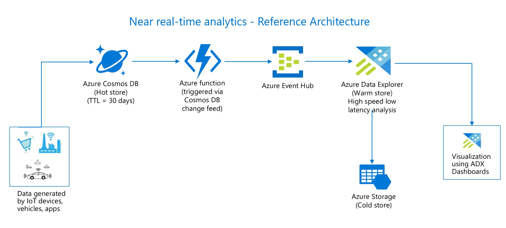

# Build near real-time analytical solution with Azure Data Explorer

**In this hands on lab you will learn about the power of near real-time analytical solution and how easy it is to build one using Azure Data Explorer(ADX) and Azure Cosmos DB.**

## NOTE
Analytical solutions can be built in mutiple ways using different azure services, this lab describes one of the possible scenarios. Similar outcomes can be achieved using other azure services which are not covered in this lab.

## Overview
Near real-time analysis provides the ability to analyze data without impacting the OLTP system. Few examples to understand its value proposition for business growth like promotions in ecommerce system as soon as user checks out, identify customer behaviour trends, fraudulent activities, response to promotions etc. 
With ADX, you get the ability to query fast-flowing data without having to wait until the data is ingested into a data warehouse, but at the same time without affecting the OLTP system's performance.

In this lab you will build the solution architecture as shown below where you will simulate and insert the transactions from an ecommerce system to Cosmos DB. Push every change in near real-time to ADX using Azure functions triggered by Cosmos DB change feed and event hub. Idea is to use Cosmos DB as an opeartional hot store, ADX as an analytical warm store and Azure storage as a cold store for archival or long term storage purposes. This architecture focuses on the below shown solution only to build a sample but it can be changed depending on requirements, for example, to push data from ADX to DW for enriching the data with historical data from other sources, modelling and reporting purposes.

## Key advantages of this architecture
 - Transactional data is readily available for analysis so you can query data in near real-time as opposed to waiting for days to get the data.
 - You can query data without impacting the OLTP system's performance.
 - Drill down from analytic aggregates always point to fresh data.

## Brief on each of the components in this lab -
1. **Data Generation component** - This will simulate random data for this lab. Its a simple .Net program to generate sample data simulating ecommerce website's events to view items, add items to shopping cart, purchase items. 
 2. **Cosmos DB** - It is an operational and transactional system which will store simulated data in a collection.
 3. **Change Feed** - The change feed will listen for changes to the Cosmos DB collection e.g. on an ecommerce website, whenever user views an item, adds an item to their cart, purchases an item etc will lead to a change in Cosmos DB collection which will trigger an azure function.
Change Feed is just like DB logs in relational world. It can be processed in push or pull model. I will be covering push model as its the recommended approach due to its ability to -
    - Poll the change feed for future changes.
    - Storing state for the last processed change. 
    - Load balancing across multiple clients consuming changes. 
    - Retrying failed changes that weren't correctly processed after an unhandled exception in code or a transient network issue.
4. **Azure Function** - It will process every change in Cosmos DB, send it to an azure event hub.
5. **Event Hub** - It is an event ingestion service which will receive events from azure function and send them to ADX.
6. **Azure Data Explorer(ADX)** - It is an analytical store which will provide the ability to analyze streaming data at a lightning speed. Why ADX -
    - ADX supports ingestions for fast flowing high volumes of data with low latency in streaming or batch mode. 
    - ADX supports structured, semistructured(JSON and XML) and unstructured(free text) data. It has a rich set of capabilities for time series analysis, log analysis(trace logs, user activity logs, CDN logs or any kind of events generated by the enterprise systems), user analytics and geospatial features. 
    - ADX automatically indexes and compresses data on ingestion and stores it in an append only columnar database.
    - You can do interactive analytics for exploration purposes in one of the most performant and cost efficient manner, write queries using KQL(Kusto Query Language) and T-SQL. It supports in-line R and Python for building ML models.
For more details, refer to this [documentation](https://azure.microsoft.com/en-au/services/data-explorer/#features).

## Prerequisites
 - Microsoft Azure Subscription with contributor or admin level access
 - Microsoft .NET Framework 4.7 or higher
 - Visual Studio 2017 or higher
 - Use either Edge or Chrome when executing the labs. IE may have issues when rendering the UI for specific Azure services
 - Basic knowledge on Azure portal

## Lets get started
[Module 1 - Create Cosmos DB account, database and container](https://github.com/minwal/cosmos-adx-int/blob/minwal-patch-1/LabModules/Module1.md)

[Module 2 - Create Storage account](https://github.com/minwal/cosmos-adx-int/blob/minwal-patch-1/LabModules/Module2.md)

[Module 3 - Create Azure Event Hub](https://github.com/minwal/cosmos-adx-int/blob/minwal-patch-1/LabModules/Module3.md)

[Module 4 - Host Azure function to be triggered by Cosmos DB Change feed](https://github.com/minwal/cosmos-adx-int/blob/minwal-patch-1/LabModules/Module4.md)

[Module 5 - Create and Configure Azure Data Explorer cluster](https://github.com/minwal/cosmos-adx-int/blob/minwal-patch-1/LabModules/Module5.md)

[Module 6 - Set up data simulator to feed data into Cosmos DB](https://github.com/minwal/cosmos-adx-int/blob/minwal-patch-1/LabModules/Module6.md)

[Module 7 - Explore, analyze and visualize data in near real time using Azure Data Explorer](https://github.com/minwal/cosmos-adx-int/blob/minwal-patch-1/LabModules/Module7.md)

